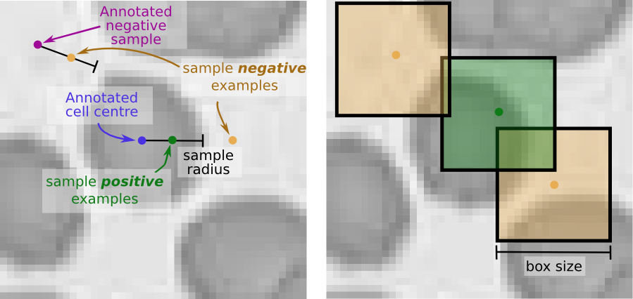

# CNN segmentation of cell images

This toy example shows how to train a 3-layered convolutional neural network in [Lasange](https://github.com/Lasagne/Lasagne) on cell images.
After training the network performs segmentation using a sliding window.

#### Getting started
Look at [main.ipynb](main.ipynb).

### Details
* Each image is manually annotated with the center point of each cell
* All patches of size `boxsize` within `positive radius` are sampled as `positive samples`
* An equal number of `negative samples` are randomly sampled between `positive radius` and `negative radius`
* A [convolutional neural network](network.py) is trained using the negative and positive samples
* Given a new image a `boxsized` window is slided through each possible patch in the image.
	* Each patch is passed through the trained network and given the most probable label.

#### Credit
The network and code structure is based on Lasanges `MNIST` example
[https://github.com/Lasagne/Lasagne/blob/master/examples/mnist.py](https://github.com/Lasagne/Lasagne/blob/master/examples/mnist.py)

Data from [Olof Enqvist](https://www.chalmers.se/en/Staff/Pages/olof-enqvist.aspx)